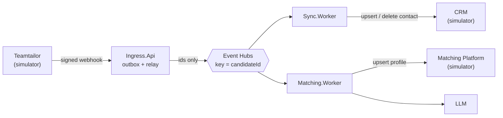

# TalentSync

An event-driven integration that syncs candidate data from an ATS (Teamtailor) to a CRM and to a consultant
matching platform, with LLM enrichment of consultant profiles.

A portfolio project: a simplified model of a real-world integration. Not production code, but designed to behave
correctly under failure: duplicate deliveries, retries, crashes and downstream outages.

> **Status: work in progress.** Documentation and acceptance scenarios first, code in small steps.

## How it works



- **Sync.Worker**: candidate created, updated or deleted → CRM contact upserted or removed.
- **Matching.Worker**: job application reaches the qualified stage → the LLM suggests skills and seniority →
  consultant profile upserted. If the LLM fails, the profile is created as `NotEnriched`.

Key decisions:

- **Notify-then-fetch**: events carry only IDs; workers fetch current state from the API.
- **Outbox** in Ingress; **at-least-once** delivery; **idempotent upserts** keyed by `candidateId`.
- **Parking lot** instead of a dead-letter queue, which Event Hubs doesn't have.
- **LLM results stored** by candidate and CV hash before the profile upsert, so retries replay the same decision.

More: [architecture](docs/architecture.md), [diagrams](docs/diagrams.md), [domain](docs/domain.md),
[acceptance scenarios](docs/acceptance-scenarios.md).

Stack: .NET 10, Azure Event Hubs SDK (no messaging framework), SQL Server 2025 + EF Core,
`Microsoft.Extensions.Http.Resilience` (Polly v8), `Microsoft.Extensions.AI`, xUnit, Docker Compose.

## Running locally

Requires .NET 10 SDK and Docker. Target commands while the setup is being built:

```bash
docker compose -f deploy/docker-compose.yml up -d
dotnet build
dotnet test
```

Set `Llm:Provider` to `Fake` to run without an LLM key. For Gemini, keep the key in user secrets:

```bash
dotnet user-secrets set "Llm:Gemini:ApiKey" "<key>" --project src/Matching/TalentSync.Matching.Worker
```

## Simplifications

- Teamtailor, the CRM and the Matching Platform are **in-memory simulators** (`simulators/`) that can be broken
  on purpose and report their calls.
- **CV as plain text**: the real Teamtailor API exposes a file (`original-resume`); the simulator exposes a
  plain-text attribute `resume-text`.
- Undocumented Teamtailor behaviour is an explicit assumption, isolated in the adapter: candidate id in job
  application webhooks, `404` = deleted resource, stage via `include=stage`.

## Working with a coding agent

The code is written in small steps with a coding agent. `CLAUDE.md` and `.claude/rules/` hold its instructions,
`.claude/settings.json` enforces the rules that must hold every time, and the scenarios in
`docs/acceptance-scenarios.md` are the definition of done: written by hand before the code, never edited to make
a test pass.

---

Not affiliated with Teamtailor; built from its public documentation.