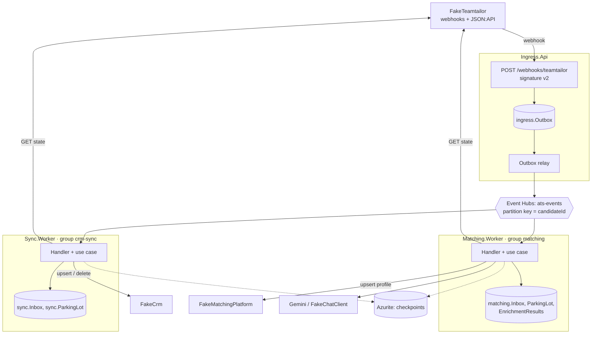
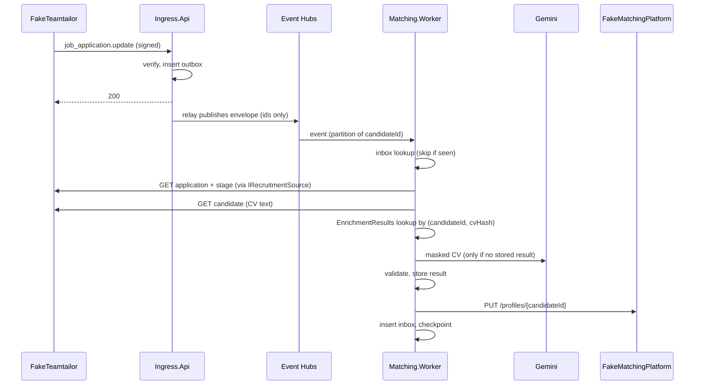
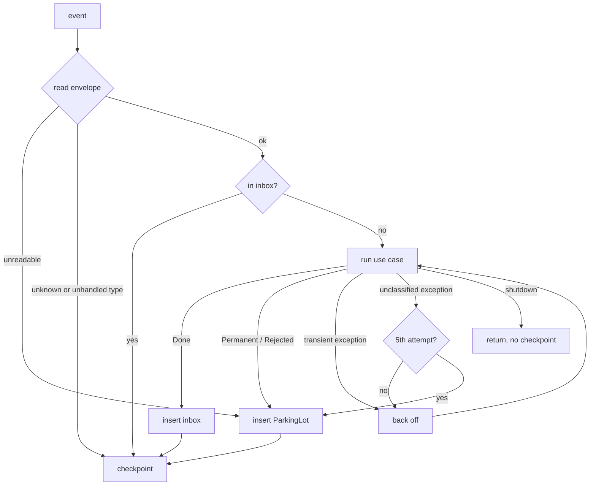

# TalentSync diagrams

For humans. Descriptive: `docs/architecture.md` is the reference for containers, layout and the key flow.
Keep these diagrams true when a container or the flow changes.

## Containers

## Key flow: application qualified

## Consumer handler: failure paths

